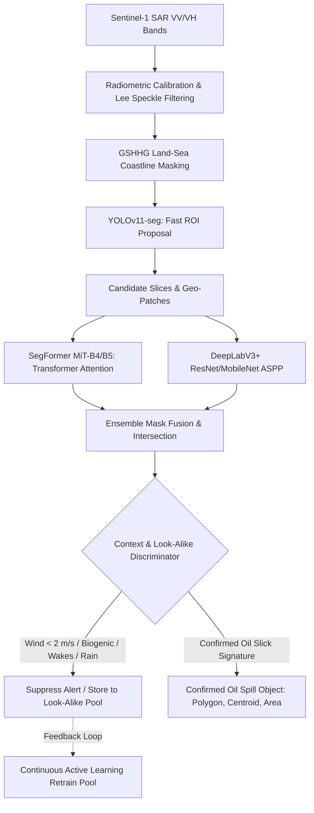
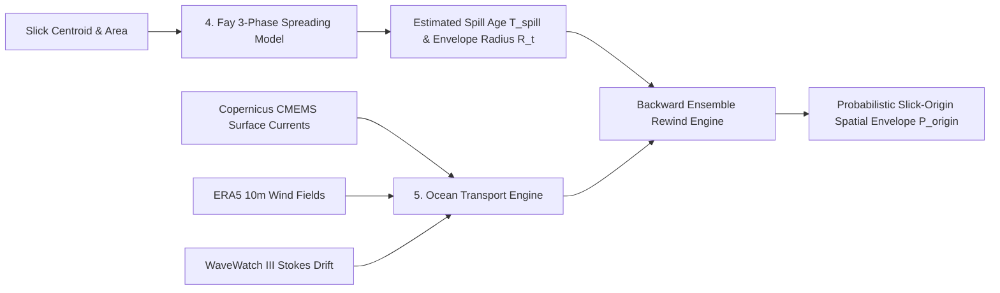
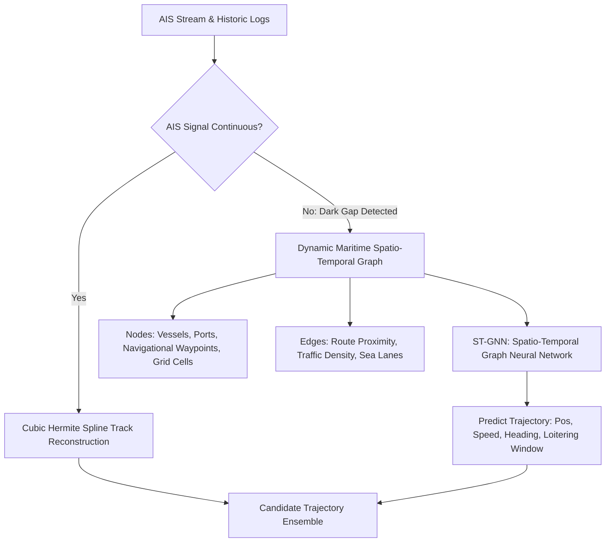
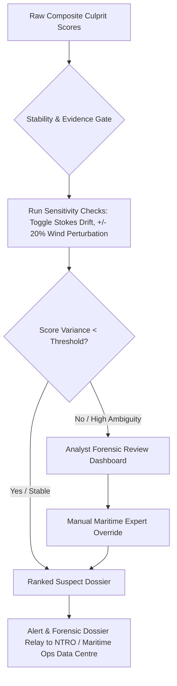

# Project DRISHTI: End-to-End System Blueprint & Technical Architecture
**Maritime Oil Spill Detection, Backward Hydrodynamic Dispersion & Dark Vessel Culprit Attribution Engine**

---

## 1. Executive Summary & System Mission

**Project DRISHTI** is a high-assurance maritime surveillance and environmental intelligence system designed to:
1. **Detect and Segment Oil Slicks**: Ingest Sentinel-1 SAR imagery, propose regions of interest with **YOLOv11-seg**, segment slicks with fine-grained multi-model vision ensembles (**SegFormer + DeepLabV3+**), and filter environmental look-alikes.
2. **Hydrodynamic Backward Rewind**: Model ocean transport via **Eulerian surface currents, 10m windage, wave-induced Stokes drift**, and **Fay’s 3-Phase Spreading Theory** to project a probabilistic backward origin envelope $\mathcal{P}_{\text{origin}}(x, y, t)$.
3. **Maritime Graph & Dark Vessel Tracking**: Ingest AIS ship feeds, construct dynamic spatio-temporal maritime graphs, and reconstruct missing vessel trajectories during AIS blackout ("dark gaps") using **Spatio-Temporal Graph Neural Networks (ST-GNN)**.
4. **Multi-Factor Culprit Attribution**: Compute a normalized, evidence-weighted composite suspect score evaluating spatial-temporal alignment, dark behavior, kinematic anomalies, and vessel risk profiles.
5. **Explainable Audit & Alert Relay**: Provide sensitivity verification (e.g., Stokes toggle check) and dispatch forensic suspect dossiers to Maritime Operations Centers (NTRO / Indian Navy / Coast Guard).

```
+----------------------------------------------------------------------------------------------------+
|                                      PROJECT DRISHTI PIPELINE                                      |
+------------------------------------+--------------------------------+------------------------------+
|   1. SAR DETECTION & SEGMENTATION  |    2. OCEAN TRANSPORT REWIND   |   3. MARITIME GRAPH & AIS    |
|   Sentinel-1 SAR (VV/VH)           |    Copernicus CMEMS Currents   |   Live & Historical AIS Data |
|   -> Calibration & Lee Despeckle   |    + ERA5 Windage (3.0-3.5%)   |   -> Continuous AIS Track    |
|   -> YOLOv11-seg ROI Proposal      |    + WaveWatch3 Stokes Drift   |   -> AIS Dark Gap Detected   |
|   -> SegFormer + DeepLabV3+ Ens.   |    -> Fay 3-Phase Spreading    |      -> ST-GNN Trajectory    |
|   -> Look-alike False-Alarm Filter |    -> Probabilistic Rewind     |         Reconstruction       |
+------------------------------------+--------------------------------+------------------------------+
                                             |
                                             v
               +-------------------------------------------------------------+
               |             4. MULTI-FACTOR ATTRIBUTION ENGINE              |
               |                                                             |
               |   [S_spatial (35%)] : Spatio-temporal overlap with rewind   |
               |   [S_dark    (30%)] : ST-GNN confidence x blackout window   |
               |   [S_behavior(20%)] : Speed drops, loitering, route drifts  |
               |   [S_risk    (15%)] : Vessel type, DWT, flag, PSC history   |
               |                                                             |
               |   -> Evidence Quality Dampening & Dynamic Normalization     |
               +-------------------------------------------------------------+
                                             |
                                             v
               +-------------------------------------------------------------+
               |           5. STABILITY GATE & RELAY DISPATCH                |
               |   Confidence Check & Sensitivity Perturbation Test          |
               |   -> High Confidence  : NTRO / Maritime Ops Relay Dispatch   |
               |   -> Weak / Ambiguous : Analyst Forensic Review Dashboard   |
               +-------------------------------------------------------------+
```

---

## 2. Comprehensive Subsystem Architecture

### Module 1: SAR Preprocessing & Multi-Model Vision Pipeline



#### Detailed Technical Specifications:
1. **Input Preprocessing**:
   - **Data**: Sentinel-1 C-band SAR Level-1 Ground Range Detected (GRD) in Interferometric Wide (IW) swath mode (VV + VH polarizations).
   - **Radiometric Calibration**: Conversion of raw Digital Numbers (DN) to backscatter coefficient $\sigma^0$ (in dB).
   - **Despeckling**: Refined Lee Filter ($7 \times 7$ kernel) or Bilateral Filtering to reduce SAR speckle noise while preserving slick edges.
   - **Land Masking**: High-resolution shoreline masking (GSHHG / OSM) to eliminate false positives in coastal mudflats.
2. **Multi-Model Segmentation**:
   - **YOLOv11-seg**: Rapidly scans high-resolution $20,000 \times 20,000$ SAR swaths with tiling to locate candidate ROI bounding boxes.
   - **SegFormer (MiT-B4/B5)**: Captures long-range spatial context and multi-scale texture features via hierarchical transformer encoders.
   - **DeepLabV3+**: Employs Atrous Spatial Pyramid Pooling (ASPP) with dilation rates $(6, 12, 18)$ to lock in exact slick boundaries.
   - **Fusion**: Pixel-level ensemble voting: $\mathcal{M}_{\text{fused}}(x,y) = \mathbb{I}\left(0.55 \cdot \mathcal{P}_{\text{SegFormer}}(x,y) + 0.45 \cdot \mathcal{P}_{\text{DeepLab}}(x,y) > \theta\right)$.
3. **Contextual False-Positive Suppression**:
   - Compares localized SAR wind estimates against critical thresholds:
     - $u_{\text{wind}} < 2.5\text{ m/s}$: Low wind calms (specular reflection look-alike).
     - $u_{\text{wind}} > 14\text{ m/s}$: Natural dispersion / wave breaking.
   - Filters out known ship wake signatures, internal waves, upwelling, and biogenic algal films using shape compactness:
     $$\text{Compactness} = \frac{4\pi \cdot \text{Area}}{\text{Perimeter}^2}, \quad \text{Elongation} = \frac{\lambda_{\text{major}}}{\lambda_{\text{minor}}}$$

---

### Module 2: Physics-Informed Ocean Hydrodynamics & Backward Rewind



#### Mathematical Formulation:
1. **Total Ocean Drift Velocity ($\vec{U}_{\text{drift}}$)**:
   $$\vec{U}_{\text{drift}}(x, y, t) = \vec{u}_{\text{current}}(x, y, t) + \alpha_{\text{wind}} \cdot \mathbf{R}(\theta_{\text{coriolis}}) \vec{u}_{10\text{m}}(x, y, t) + \vec{u}_{\text{Stokes}}(x, y, t)$$
   - $\vec{u}_{\text{current}}$: Eulerian ocean surface velocity from Copernicus CMEMS ($1/12^\circ$ resolution).
   - $\alpha_{\text{wind}}$: Windage coefficient ($0.030 - 0.035$, i.e., $3 - 3.5\%$).
   - $\mathbf{R}(\theta_{\text{coriolis}})$: Wind deflection matrix ($0^\circ - 20^\circ$ clockwise in Northern Hemisphere).
   - $\vec{u}_{\text{Stokes}}$: Wave-induced Stokes drift calculated from wave spectrum peak frequency and significant wave height ($H_s, T_p$):
     $$\vec{u}_{\text{Stokes}} \approx \frac{1}{16} H_s^2 \omega_p k_p e^{2 k_p z} \hat{k}_{\text{wave}}$$
2. **Fay’s 3-Phase Spreading Model**:
   - **Phase 1 (Gravity-Inertia)**: $R_1(t) = k_1 \left(\Delta \cdot g \cdot V \cdot t^2\right)^{1/4}$
   - **Phase 2 (Gravity-Viscous)**: $R_2(t) = k_2 \left(\frac{\Delta \cdot g \cdot V^2 \cdot t^{3/2}}{\nu_{\text{water}}^{1/2}}\right)^{1/6}$
   - **Phase 3 (Surface Tension-Viscous)**: $R_3(t) = k_3 \left(\frac{\sigma_{\text{net}}^2 \cdot t^3}{\rho_{\text{water}}^2 \cdot \nu_{\text{water}}}\right)^{1/4}$
   - Where $\Delta = 1 - \frac{\rho_{\text{oil}}}{\rho_{\text{water}}}$, $V = \text{estimated oil volume}$, and $\sigma_{\text{net}} = \text{spreading coefficient}$.
   - Inversion of measured slick area $A_{\text{slick}}$ yields estimated discharge age $T_{\text{spill}} \pm \sigma_T$.
3. **Monte Carlo Backward Lagrangian Rewind**:
   - Propagates $N = 1,000$ virtual particles backward in time $t \in [t_{\text{detection}}, t_{\text{detection}} - T_{\text{max}}]$:
     $$\mathbf{x}_p(t - \Delta t) = \mathbf{x}_p(t) - \vec{U}_{\text{drift}}(\mathbf{x}_p, t)\Delta t + \sqrt{2 K_h \Delta t}\,\vec{\xi}_p$$
   - $K_h$: Horizontal eddy diffusivity tensor ($1 - 10\text{ m}^2/\text{s}$).
   - $\vec{\xi}_p \sim \mathcal{N}(0, \mathbf{I})$: Stochastic turbulent diffusion.
   - Yields 2D Gaussian Kernel Density Origin Envelope $\mathcal{P}_{\text{origin}}(x, y, t)$.

---

### Module 3: Spatio-Temporal Maritime Graph & Dark Vessel Tracking (ST-GNN)



#### ST-GNN Architecture for Dark Vessel Reconstruction:
1. **Dynamic Maritime Graph Definition $\mathcal{G}_t = (\mathcal{V}_t, \mathcal{E}_t)$**:
   - **Node Features ($\mathbf{v}_i \in \mathcal{V}$)**: Vessel state $[x_i, y_i, v_i, \theta_i, \text{draft}_i, \text{type}_i, \Delta t_{\text{dark}}]$ and sea-grid environmental state $[\vec{u}_{\text{current}}, \vec{u}_{\text{wind}}]$.
   - **Edge Weights ($e_{ij} \in \mathcal{E}$)**: Geographical distance, historical shipping channel connectivity, route topology.
2. **Spatio-Temporal Graph Convolutional Block**:
   - **Spatial Dimension**: Graph Attention Network (GATv2) capturing vessel interactions and lane constraints:
     $$\mathbf{h}_i^{(l+1)} = \sigma\left(\sum_{j \in \mathcal{N}_i} \alpha_{ij} \mathbf{W} \mathbf{h}_j^{(l)}\right), \quad \alpha_{ij} = \frac{\exp\left(\text{LeakyReLU}\left(\mathbf{a}^T [\mathbf{W}\mathbf{h}_i \,\|\, \mathbf{W}\mathbf{h}_j]\right)\right)}{\sum_{k \in \mathcal{N}_i}\exp\left(\text{LeakyReLU}\left(\mathbf{a}^T [\mathbf{W}\mathbf{h}_i \,\|\, \mathbf{W}\mathbf{h}_k]\right)\right)}$$
   - **Temporal Dimension**: Temporal Convolutional Networks (TCN) or Bidirectional GRU with attention over time steps $t - \tau \dots t$.
3. **Trajectory In-filling & Dark Kinematics**:
   - Computes expected position $\hat{\mathbf{x}}_i(t)$ and covariance ellipse $\mathbf{\Sigma}_i(t)$ across dark period $\Delta t_{\text{gap}}$.

---

### Module 4: Multi-Factor Suspect Attribution Engine

The attribution engine evaluates 4 distinct behavioral and physical dimensions:

| Score Dimension | Notation | Core Factors & Equations | Weight |
| :--- | :--- | :--- | :---: |
| **Spatial Match Score** | $S_{\text{spatial}}(i)$ | Overlap integral between vessel trajectory $\mathbf{x}_i(t)$ and backward rewind probability envelope $\mathcal{P}_{\text{origin}}(x, y, t)$: $$S_{\text{spatial}}(i) = \max_t \iint \mathcal{P}_{\text{origin}}(x, y, t) \cdot \mathcal{N}(\mathbf{x}_i(t), \mathbf{\Sigma}_i(t)) \, dx dy$$ | **35%** |
| **AIS Dark Score** | $S_{\text{dark}}(i)$ | Anomaly score for transponder shutoff near discharge window: $$S_{\text{dark}}(i) = \mathbb{I}_{\text{dark}} \cdot \left[1 - \exp\left(-\frac{\Delta t_{\text{dark}}}{\tau_0}\right)\right] \cdot \mathcal{P}_{\text{ST-GNN}}(\text{in zone})$$ | **30%** |
| **Behavioral Anomaly Score** | $S_{\text{behavior}}(i)$ | Evaluates kinematic anomalies (sudden deceleration, zigzagging, unannounced loitering, lane deviation): $$S_{\text{behavior}}(i) = w_1 |\Delta v| + w_2 |\Delta \theta| + w_3 \mathbb{I}_{\text{loiter}} + w_4 d_{\text{lane\_deviation}}$$ | **20%** |
| **Vessel Risk Profile** | $S_{\text{risk}}(i)$ | Prior risk based on vessel category, deadweight tonnage, age, flag state risk index, and PSC inspection records: $$S_{\text{risk}}(i) = f(\text{VesselType}, \text{Age}, \text{FlagStateRisk}, \text{PastViolations})$$ | **15%** |

#### Evidence-Quality Assessment & Dynamic Weighting:
- **Crowded Sea Lane Penalty**: When multiple ships $M$ simultaneously intersect the origin envelope:
  $$\gamma_{\text{evidence}} = \frac{1}{\sqrt{M}}$$
- **Composite Suspect Score**:
  $$S_{\text{culprit}}(i) = \gamma_{\text{evidence}} \cdot \left[ 0.35 \cdot S_{\text{spatial}}(i) + 0.30 \cdot S_{\text{dark}}(i) + 0.20 \cdot S_{\text{behavior}}(i) + 0.15 \cdot S_{\text{risk}}(i) \right]$$
- Normalized across all candidates: $\tilde{S}_{\text{culprit}}(i) = \frac{S_{\text{culprit}}(i)}{\sum_j S_{\text{culprit}}(j)}$.

---

### Module 5: Stability Gate, Sensitivity Checks & NTRO Relay



---

## 3. Gap Analysis: Current Notebook (`drishti.ipynb`) vs. Target System

| Component | In Current `drishti.ipynb` | Required for Target Full DRISHTI System |
| :--- | :--- | :--- |
| **SAR Segmentation** | SMP U-Net with ResNet-34 on Kaggle 3-class dataset | **YOLOv11-seg** ROI proposal + **SegFormer-B4** + **DeepLabV3+** ensemble with true Sentinel-1 GRD TIFF ingestion & calibration. |
| **Georeferencing** | Pixel index to lat/lon with fixed assumed GSD ($10\text{ m/px}$) | Exact **Rasterio / GDAL Affine Transformation** and SAR Ground Control Point (GCP) geolocation from Sentinel-1 metadata. |
| **Ocean Drift Model** | Static uniform 2D displacement vector $(disp_x, disp_y)$ | **Time-varying Lagrangian rewind** with Copernicus CMEMS currents, ERA5 windage ($3\%$), and WaveWatch III Stokes drift. |
| **Slick Spreading** | None (instantaneous point source assumption) | **Fay 3-phase oil spreading model** to compute slick age envelope $T_{\text{spill}}$ and volume-constrained expansion. |
| **AIS Tracking** | Synthetic dictionary of 3 vessels with linear offset | Real/Simulated **NMEA/AIVDM AIS stream parser**, spatial indexing (R-Tree/H3), and historical route graph. |
| **Dark Vessel In-filling** | Simple kinematic constant heading projection | **ST-GNN (PyTorch Geometric)** spatio-temporal graph modeling with lane-constrained trajectory probabilities. |
| **Attribution Engine** | $0.6 \cdot S_{\text{spatial}} + 0.4 \cdot S_{\text{dark}}$ | Full **4-Factor Engine** (Spatial $35\%$, Dark $30\%$, Behavior $20\%$, Risk $15\%$) + Evidence Quality Assessment. |
| **Output / Interface** | Static Matplotlib scatter plot & CSV download in Colab | **Full-Stack Web Application** (Interactive Leaflet/Deck.gl Map, SAR Layer controls, Drift Animation, NTRO Relay Export). |

---

## 4. GitHub Model Integration Plan

When you share your GitHub repository links, they will map into DRISHTI as follows:

```
drishti_platform/
├── core/
│   ├── sar_vision/           <-- Integration for YOLOv11-seg, SegFormer, DeepLabV3+
│   │   ├── preprocessor.py   # Radiometric calibration, Lee filter, land mask
│   │   ├── yolo_detector.py  # Ultralytics YOLOv11 ROI proposer
│   │   ├── segformer_net.py  # HuggingFace / MMSeg SegFormer model
│   │   ├── deeplab_net.py    # DeepLabV3+ ASPP segmentation
│   │   └── ensemble.py       # Context filter & mask fusion
│   │
│   ├── hydrodynamics/        <-- Integration for Ocean Drift & Fay Spreading
│   │   ├── fay_spread.py     # Fay 3-phase gravity-viscous spreading
│   │   ├── stokes_drift.py   # Wave-induced Stokes drift calculator
│   │   ├── ocean_service.py  # Copernicus Marine / HYCOM / ERA5 client
│   │   └── lagrangian.py     # Monte Carlo backward particle rewind
│   │
│   ├── maritime_graph/       <-- Integration for ST-GNN & AIS Tracking
│   │   ├── ais_parser.py     # NMEA / GeoJSON AIS stream handler
│   │   ├── graph_builder.py  # Sea-lane & vessel spatio-temporal graph
│   │   └── st_gnn_model.py   # PyTorch Geometric ST-GNN trajectory predictor
│   │
│   └── attribution/          <-- Integration for Scoring & Audit Gate
│       ├── spatial_scorer.py # Hydrodynamic-trajectory overlap integral
│       ├── dark_scorer.py    # AIS blackout anomaly evaluation
│       ├── behavior_risk.py  # Kinematic anomaly & vessel risk profile
│       ├── engine.py         # Controlled dynamic weighting & normalization
│       └── stability_gate.py # Sensitivity test (Stokes toggle / Monte Carlo)
│
├── api/                      # FastAPI Backend REST & WebSocket Endpoints
└── web/                      # Modern Interactive Web Prototype (Phase 2)
```

---

## 5. Web Prototype Architecture (Phase 2 Preview)

Once we finalize the core blueprint, the web dashboard will provide:
1. **Satellite SAR Viewer**:
   - Interactive zoomable viewport with SAR false-color rendering, calibrated dB histogram stretch, and detected slick bounding polygons.
2. **Interactive Hydrodynamic Rewind Player**:
   - Timeline scrubber showing oil slick backward propagation with particle vectors, Eulerian current arrows, and Stokes drift vectors.
3. **Live AIS Vessel & Dark Gap Visualizer**:
   - Live ship positions, dashed ST-GNN dark trajectory cones, and vessel identity metadata cards (IMO, MMSI, Vessel Type, Flag).
4. **Culprit Dossier & Evidence Radar**:
   - Suspect ranking leaderboard with radar chart breakdown ($S_{\text{spatial}}, S_{\text{dark}}, S_{\text{behavior}}, S_{\text{risk}}$), Stokes sensitivity toggle, and one-click **"Export NTRO Relay Incident Report (PDF/GeoJSON)"**.

---

## 6. Next Steps & Ready for Your GitHub Repositories

1. **Provide the GitHub Repositories**: Share the repository links or model code snippets you plan to integrate.
2. **Review the Blueprint**: Confirm if you want any parameter or weighting adjustments (e.g., specific weights for SAR models or attribution factors).
3. **Build the Core Pipeline Modules**: We will structure the clean modular Python backend.
4. **Launch the Prototype Web Dashboard**: We will build the full interactive interface.
